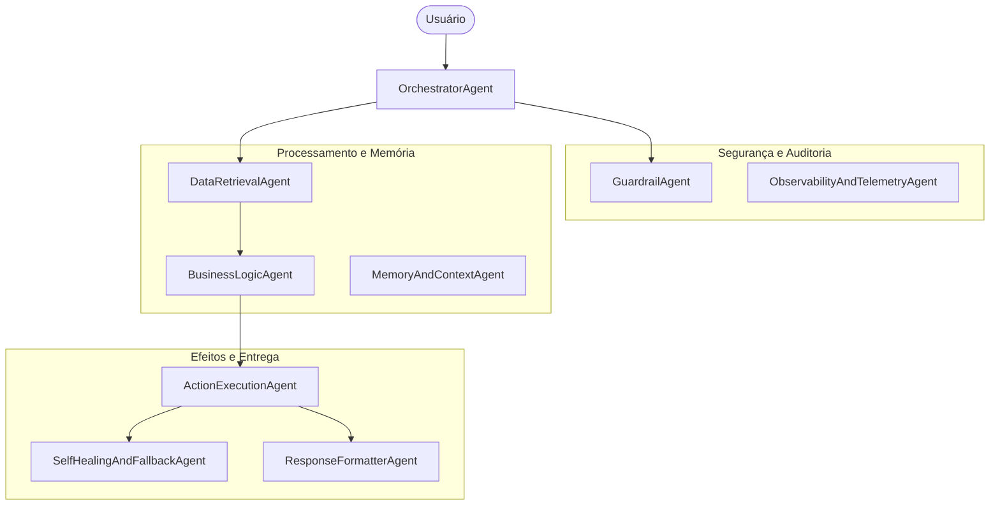

# Especificação: Evolução da Arquitetura Multi-Agente e Catálogo de Skills

Esta especificação define o mapa estratégico, a responsabilidade de cada um dos **9 Subagentes** e as diretrizes de suas **27 Skills** associadas, elevando o framework Automatize Agent a um padrão de maturidade corporativo.

---

## 1. Visão Geral da Arquitetura
A arquitetura proposta separa as responsabilidades do agente em três macrocamadas (Orquestração e Segurança, Processamento e Execução, e Telemetria e Resiliência), utilizando subagentes especialistas e skills atômicas e reutilizáveis.

---

## 2. Detalhamento da Squad de Subagentes

### A. Camada de Orquestração, Segurança e Telemetria

#### 1. OrchestratorAgent (O Maestro)
Responsável pela decomposição de problemas e roteamento das execuções.
*   **IntentParsingSkill:** Extração de intenções e entidades cruciais do input do usuário.
*   **DAGExecutionPlannerSkill:** Criação de fluxos acíclicos direcionados para rodar tarefas concorrentes ou sequenciais.
*   **StateManagementSkill:** Controle do estado transiente e memória de curto prazo durante as iterações.

#### 2. GuardrailAgent (O Auditor de Segurança)
Interceptador de entradas e saídas para garantia de segurança e compliance.
*   **InputSanitizationSkill:** Prevenção de injeção de prompt e código malicioso.
*   **HallucinationCheckerSkill:** Validação factual da saída gerada versus dados recuperados.
*   **PIIAnonymizerSkill:** Mascaramento e anonimização de dados sensíveis (LGPD/GDPR).

#### 3. ObservabilityAndTelemetryAgent (O Auditor do Sistema)
Monitoramento fino de custos, latências e trilhas de execução.
*   **TokenBudgetEnforcerSkill:** Gestão de custos financeiros por execução de LLM.
*   **TraceLoggingSkill:** Registro detalhado da árvore de chamadas de agentes e skills.
*   **LatencyMonitorSkill:** Rastreamento de gargalos de rede e tempo de execução.

---

### B. Camada de Processamento de Contexto e Inteligência

#### 4. DataRetrievalAgent (O Pesquisador)
Alimentação do contexto através de buscas internas e externas.
*   **VectorSearchSkill:** Busca semântica e RAG utilizando embeddings.
*   **APIFetchingSkill:** Conexão a APIs REST/GraphQL com tratamento de rate limits.
*   **DocumentParsingSkill:** Conversão de arquivos brutos (PDFs, Planilhas, CSV) em texto estruturado limpo.

#### 5. BusinessLogicAgent (O Processador)
Implementação de cálculos e regras lógicas do negócio.
*   **DataTransformationSkill:** Modelagem e normalização de payloads e estruturas.
*   **RuleEngineSkill:** Avaliação de conformidade e árvores de decisão.
*   **AnomaliesDetectionSkill:** Identificação de fraudes ou inconsistências transacionais.

#### 6. MemoryAndContextAgent (O Historiador)
Persistência de dados a longo prazo e comportamento de sessão persistente.
*   **EpisodicMemorySkill:** Resgate e consolidação de interações de sessões passadas.
*   **SemanticProfileSkill:** Vetorização e rastreamento de preferências da persona do usuário.
*   **ContextPruningSkill:** Resumos e podas inteligentes para otimização da janela de contexto.

---

### C. Camada de Ações e Efeitos Colaterais

#### 7. ActionExecutionAgent (O Executor)
Efeitos colaterais no mundo físico (bancos, mensagerias, integrações).
*   **DatabasePersistenceSkill:** Operações seguras de CRUD (SQL e NoSQL).
*   **WebhookDispatcherSkill:** Disparo confiável de eventos externos.
*   **NotificationTriggerSkill:** Disparador de notificações (E-mail, WhatsApp, Slack).

#### 8. SelfHealingAndFallbackAgent (O Paramédico)
Resiliência e recuperação automática de erros antes do reporte ao usuário.
*   **ErrorAnalysisSkill:** Categorização de falhas em transientes ou lógicas.
*   **RetryWithExponentialBackoffSkill:** Política de retentativa inteligente com recuo exponencial.
*   **ModelDegradationSkill:** Fallback automático para LLMs secundárias em caso de timeout/queda.

#### 9. ResponseFormatterAgent (O Designer de Interface)
Formatação e adaptação final da resposta para consumo (humano ou máquina).
*   **MarkdownSynthesizerSkill:** Tradução de lógica bruta para relatórios limpos com tabelas e realces.
*   **JSONSchemaFormatterSkill:** Garantia de tipagem estrita para respostas de APIs (estruturadas).
*   **ToneAdapterSkill:** Adequação de linguagem e tom de voz conforme a persona alvo.

---

## 3. Diretrizes de Implementação no Framework
As especificações acima serão incorporadas ao Automatize Agent como guias de templates:
1. Cada subagente possuirá um arquivo correspondente dentro do diretório `.agent/subagents/` especificando sua persona e escopo de atuação.
2. Cada skill será encapsulada em um arquivo `SKILL.md` dentro de `.agent/skills/[categoria]/[nome]/SKILL.md`, detalhando suas entradas, regras de processamento e saídas.
